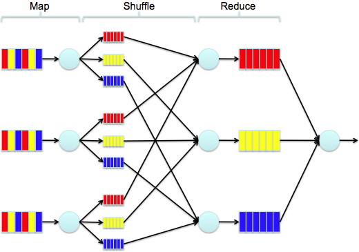

## MapReduce w przykładach



Źródło: Tom Gersic,
[Big Data Made Small with Heroku, DynamoDB, and Elastic Map Reduce](http://www.modelmetrics.com/tomgersic/big-data-made-small-with-heroku-dynamodb-and-elastic-map-reduce/)

> It’s impossible to overstress this:<br>
> 80% of the work in any data project is in cleaning the data.
>
> — DJ Patil, „Data Jujitsu”

1. Bzyl, Włodzimierz. [4 książki z Project Gutenberg](/docs/wbzyl.md).
1. Bełcik, Jakub.
1. Białkowski, Dominik.
1. Brzeziński, Damian.
1. Cała, Mariusz.
1. Dermont, Jacek. [Lista anime](/docs/jdermont.md).
1. Detlaf, Krzysztof.
1. Dępczyk, Michał.
1. Dobrzycki, Wojciech.
1. Dolata, Jƒôdrzej.
1. Domurat, Szymon.
1. Duwe, Oskar.
1. Elszkowski, Adrian.
1. Gałka, Jacek.
1. Głowacki, Michał.
1. Gniado, Bartosz.
1. Groszek, Rafał.
1. Januszewski, Tomasz.
1. Jaźwiński, Robert.
1. Karczewski, Kamil.
1. Karwowski, Kamil.
1. Kłeczek, Piotr.
1. Kotłowski, Piotr.
1. Koźmiński, Marcin.
1. Królik, Przemysław.
1. Kubacki, Konrad.
1. Kwiatkowski, Mateusz.
1. Lewandowska, Marta.
1. Łuczun, Rafał.
1. Malinowski, Piotr.
1. Małecki, Maciej.
1. Matulewski, Damian.
1. Melzer, Grzegorz.
1. Mieszała, Konrad.
1. Motel, Mateusz.
1. Motławski, Mateusz.
1. Napiórkowski, Sebastian. [Cascading Flight Delays](/docs/sebnapi/README.md).
1. Osƒôkowski, Dominik.
1. Osiński, Miłosz.
1. Ostrowski, Michał.
1. Paczyński, Łukasz.
1. Piasecka, Aleksandra.
1. Pietraszuk, Bartłomiej.
1. Pikora, Mateusz.
1. Plichta, Oskar.
1. Puchalski, Paweł.
1. Rogaszewski, Piotr.
1. Rybarczyk, Karolina.
1. Sawicki, Paweł.
1. Siora, Kacper.
1. Skiba, Marek.
1. Skowroński, Krzysztof.
1. Smykowski, Adrian.
1. Sott, Tomasz.
1. Stefanowicz, Micha≈Ç.[Przyk≥adowa szko≥a](/docs/mstefanowicz.md).
1. Szygenda, Mateusz.
1. Tomczak, Robert.
1. Wąsowicz, Michał.
1. Winsławski, Bartłomiej.
1. Wi≈õniewski, Konrad.
1. Wi≈õniewski, Konrad.
1. Zdunek, Kamil.
1. Żarkowski, Mateusz.


## GitHub Archive

* [GitHub Archive](http://www.githubarchive.org/)
* Ilya Grigorik,
  [Analyzing Millions of GitHub Commits](http://www.google.pl/url?sa=t&rct=j&q=&esrc=s&source=web&cd=2&cad=rja&ved=0CDgQFjAB&url=http%3A%2F%2Fwww.igvita.com%2Fslides%2F2012%2Fbigquery-github-strata.pdf&ei=8eRrUZqYBMzUPLyTgKgM&usg=AFQjCNEv9Hx24NBpY-8dUo3GTsIbmw2FSg&sig2=RP1s7lwR510QmA7r5NVRQQ&bvm=bv.45175338,d.ZWU)


Przykładowy JSON:

```json
{
  "repository": {
    "master_branch": "master",
    "pushed_at": "2013-03-31T06:14:38-07:00",
    "created_at": "2011-01-12T03:10:05-08:00",
    "language": "JavaScript",
    "forks": 4,
    "stargazers": 8,
    "watchers": 8,
    "homepage": "",
    "description": "",
    "url": "https://github.com/wbzyl/nosql-tutorial",
    "name": "nosql-tutorial",
    "id": 1245063,
    "fork": false,
    "size": 564,
    "owner": "wbzyl",
    "private": false,
    "open_issues": 0,
    "has_issues": true,
    "has_downloads": true,
    "has_wiki": true
  },
  "actor_attributes": {
    "email": "matwb@univ.gda.pl",
    "location": "Poland",
    "blog": "http://tao.inf.ug.edu.pl/",
    "company": "Institute of  Informatics, The University of Gdańsk",
    "name": "Wlodek Bzyl",
    "gravatar_id": "5daf79134c95a64ccdbf2bd477e52392",
    "type": "User",
    "login": "wbzyl"
  },
  "actor": "wbzyl",
  "url": "https://github.com/wbzyl/nosql-tutorial/compare/073c0ed4c5...e5a8ae8209",
  "type": "PushEvent",
  "public": true,
  "payload": {
    "head": "e5a8ae820950953ce115801fe099d42ecb481ed1",
    "ref": "refs/heads/master",
    "size": 1,
    "shas": [
      [
        "e5a8ae820950953ce115801fe099d42ecb481ed1",
        "matwb@univ.gda.pl",
        "update README-Ruby.md",
        "Wlodek Bzyl",
        true
      ]
    ]
  },
  "created_at": "2013-03-31T06:14:39-07:00"
}
```
