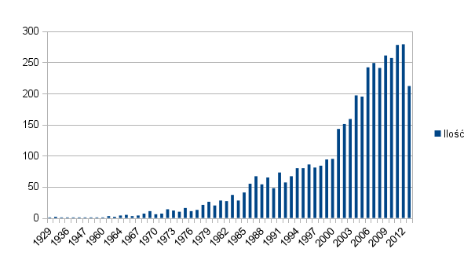

# Lista anime - Map Reduce na [tych danych](../data/jdermont/anime.json.zip)

### Jacek Dermont

Baza zawiera 4322 wpisów anime.

Przyładowy wpis:
```json
{
  "year" : 2007,
  "episodes" : 1,
  "_id" : 2989,
  "type" : "MOV",
  "title" : "Pokémon Diamond to Pearl: Dialga vs Palkia vs Darkrai"
}
```

## Map Reduce nr 1 - ilość rodzajów anime
```js
var map1 = function() {
  emit(this.type, 1);
};
```

```js
var reduce1 = function(key,val) {
  var count = 0;
  for(i = 0; i < val.length; i++) {
    count += val[i];
  }
  return count;
};
```

```js
var result1 = db.anime.mapReduce(
  map1,
  reduce1,
  { out : "typ" }
);
```

Wynik wykonania:

```json
{
  "result" : "typ",
  "timeMillis" : 46,
  "counts" : {
  "input" : 4322,
  "emit" : 4322,
  "reduce" : 210,
  "output" : 6
  },
  "ok" : 1,
}
```

Wynik:
```json
> db.typ.find()
{ "_id" : "MOV", "value" : 804 }
{ "_id" : "OAV", "value" : 1019 }
{ "_id" : "ONA", "value" : 77 }
{ "_id" : "PD", "value" : 18 }
{ "_id" : "SP", "value" : 401 }
{ "_id" : "TV", "value" : 2003 }
```

## Map Reduce nr 2 - ilość anime w danym roku
```js
var map2 = function() {
  emit(this.year, 1);
};
```

```js
var reduce2 = function(key, val) {
  var count = 0;
  for(i = 0; i < val.length; i++) {
    count += val[i];
  }
  return count;
};
```

```js
var result2 = db.anime.mapReduce(
  map2,
  reduce2,
  { out : "rok" }
);
```

Wynik wykonania:
```json
{
  "result" : "rok",
  "timeMillis" : 128,
  "counts" : {
  "input" : 4322,
  "emit" : 4322,
  "reduce" : 363,
  "output" : 63
  },
  "ok" : 1,
}
```

Wynik:
```json
{ "_id" : 1929, "value" : 1 }
{ "_id" : 1933, "value" : 2 }
{ "_id" : 1934, "value" : 1 }
{ "_id" : 1936, "value" : 1 }
{ "_id" : 1943, "value" : 1 }
// ...
{ "_id" : 2011, "value" : 278 }
{ "_id" : 2012, "value" : 279 }
{ "_id" : 2013, "value" : 212 }
```


