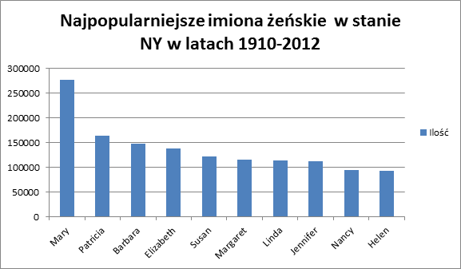

<h1> Zadanie 3 <h1>

Dane zostały pobrane ze strony catalog.data.gov z USA i dotyczą popularności imion żeńskich i męskich osób z aplikacji w systemie ubezpieczeń społecznych w czterech stanach USA (CA, TX, IL, NY) na przestrzeni lat 1910-2012.

<br/>

<h2> MongoDB - import danych </h2>

```sh
echo %time%
18:56:08,99
mongoimport -d babies -c names --type csv --headerline --file names.csv
echo %time%
18:58:35,56
```


Sprawdzenie liczby rekordów:

```sh
C:\mongodb\bin>mongo
MongoDB shell version: 2.4.3
connecting to: test
 use babies
switched to db babies
 db.names.count()
1128181
```

Przykładowy rekord:

```sh
 db.names.findOne()
{
        "_id" : ObjectId("52bb1c5d16752993c0c7836e"),
        "state" : "CA",
        "sex" : "F",
        "year_of_birth" : 1910,
        "name" : "Mary",
        "number" : 295
}
```

<h2>MongoDB- MapReduce</h2>
10 najpopularniejszych imion w latach 1910-2013


Funkcja dotycząca imienia i liczby jego występowania.
```sh
var mapFunction1 = function() {
                       emit(this.name, this.number);
                   };
```

Funkcja zliczająca ilość występowania danego imienia.
```sh
var reduceFunction1 = function(key, values) {
                          return Array.sum(values);
                      };
```

MapReduce:
```sh
db.names.mapReduce(
                     mapFunction1,
                     reduceFunction1,
                     { out: "mapReduce1" }
                   )
```

Wynik:
```sh
{
        "result" : "mapReduce1",
        "timeMillis" : 61984,
        "counts" : {
                "input" : 1128181,
                "emit" : 1128181,
                "reduce" : 297240,
                "output" : 25007
        },
        "ok" : 1,
}
```

Wybranie 10 najpopularniejszych imion:
```sh
 db.mapReduce1.find().limit(10).sort({value:-1})
{ "_id" : "Michael", "value" : 1327668 }
{ "_id" : "John", "value" : 1308670 }
{ "_id" : "Robert", "value" : 1282317 }
{ "_id" : "James", "value" : 1132978 }
{ "_id" : "David", "value" : 1037278 }
{ "_id" : "William", "value" : 892236 }
{ "_id" : "Mary", "value" : 839123 }
{ "_id" : "Richard", "value" : 746056 }
{ "_id" : "Joseph", "value" : 725289 }
{ "_id" : "Daniel", "value" : 634562 }
```

Najpopularniejsze imiona w latach 1910-2012: <br/>
1.Michael - 1327668  <br/>
2.John - 1308670  <br/>
3.Robert - 1282317  <br/>
4.James - 1132978  <br/>
5.David - 1037278  <br/>
6.William - 892236  <br/>
7.Mary - 839123  <br/>
8.Richard - 746056  <br/>
9.Joseph - 725289  <br/>
10.Daniel - 634562  <br/>


10 najpopularniejszych imion żeńskich w stanie NY na przestrzeni lat 1910-2012

Funkcja dotycząca imienia i liczby jego występowania.
```sh
var mapFunction2 = function() {
   if(this.sex == "F" && this.state== "NY")
                       emit(this.name, this.number);
                   };  
```

Funkcja zliczająca ilość występowania danego imienia.
```sh
var reduceFunction2 = function(key, values) {
                          return Array.sum(values);
                      };
```

MapReduce:
```sh
db.names.mapReduce( mapFunction2, reduceFunction2, {out: "mapReduce2"})
```

Wynik:
```sh
 db.names.mapReduce( mapFunction2, reduceFunction2, {out: "mapReduce2"})
{
        "result" : "mapReduce2",
        "timeMillis" : 25284,
        "counts" : {
                "input" : 1128181,
                "emit" : 153945,
                "reduce" : 40935,
                "output" : 8821
        },
        "ok" : 1,
}
```

Wybranie 10 najpopularniejszych imion:
```sh
 db.mapReduce2.find().sort({value:-1}).limit(10)
{ "_id" : "Mary", "value" : 276334 }
{ "_id" : "Patricia", "value" : 163326 }
{ "_id" : "Barbara", "value" : 146964 }
{ "_id" : "Elizabeth", "value" : 137730 }
{ "_id" : "Susan", "value" : 122239 }
{ "_id" : "Margaret", "value" : 115421 }
{ "_id" : "Linda", "value" : 113757 }
{ "_id" : "Jennifer", "value" : 111293 }
{ "_id" : "Nancy", "value" : 93465 }
{ "_id" : "Helen", "value" : 92911 }
```
Najpopularniejsze imiona żeńskie w NY w latach 1910-2012: <br/>
1.Mary - 276334   <br/>
2.Patricia- 163326  <br/>
3.Barbara - 146964  <br/>
4.Elizabeth - 137730  <br/>
5.Susan - 122239  <br/>
6.Margaret - 115421  <br/>
7.Linda - 113757  <br/>
8.Jennifer - 111293  <br/>
9.Nancy -  93465   <br/>
10.Helen - 92911  <br/>


