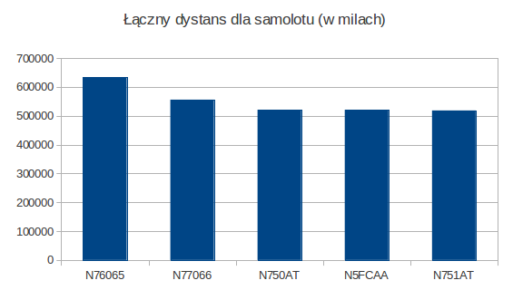

<h1>Zadanie3</h1>
<h2>Tomasz Sott</h2>

Dane do zadania3 pochodza ze strony www.transtats.bts.gov/DL_SelectFields.asp?Table_ID=236&DB_Short_Name=On-Time
Dotycza ruchu powietrznego na terenie USA w pierwszym kwartale 2013 roku. Dane na stronie podzielone sa wedlug miesiecy.

<h3>Import danych</h3>

import danych ze stycznia 2013:
```sh
	time mongoimport -d traffic -c air -type csv --headerline -file 433312457_T_ONTIME_2013_1.csv
	...
	Sun Dec  8 15:53:20.849 check 9 509520
	Sun Dec  8 15:53:21.112 imported 509519 objects
	
	real	1m6.898s
	user	0m39.148s
	sys	0m1.692s
```

import danych z lutego 2013:
```sh
	time mongoimport -d traffic -c air -type csv --headerline -file 433314029_T_ONTIME_2013_2.csv
	...
	Sun Dec  8 15:58:24.691 check 9 469747
	Sun Dec  8 15:58:25.012 imported 469746 objects
	
	real	1m2.581s
	user	0m35.540s
	sys	0m1.536s
```

import danych z marca 2013:
```sh
	time mongoimport -d traffic -c air -type csv --headerline -file 433314029_T_ONTIME_2013_3.csv 
	...
	Sun Dec  8 16:02:19.943 check 9 552313
	Sun Dec  8 16:02:20.327 imported 552312 objects
	
	real	1m13.893s
	user	0m42.136s
	sys	0m1.840s
```

Sprawdzenie liczby rekordow:
```sh
	> use traffic
	switched to db traffic
	> db.air.count()
	1531577
```
Przykladowy rekord:
```sh	
	> db.air.findOne()
	{
		"_id" : ObjectId("52a4879ea57524964ba8e4d7"),
		"QUARTER" : 1,
		"MONTH" : 1,
		"FL_DATE" : "2013-01-17",
		"AIRLINE_ID" : 20363,
		"CARRIER" : "9E",
		"TAIL_NUM" : "N923XJ",
		"ORIGIN_AIRPORT_ID" : 11298,
		"ORIGIN" : "DFW",
		"ORIGIN_CITY_NAME" : "Dallas/Fort Worth, TX",
		"DEST_AIRPORT_ID" : 12478,
		"DEST" : "JFK",
		"DEST_CITY_NAME" : "New York, NY",
		"DEP_DEL15" : 0,
		"DEP_DELAY_GROUP" : -1,
		"ARR_DEL15" : 0,
		"ARR_DELAY_GROUP" : -1,
		"CANCELLED" : 0,
		"DIVERTED" : 0,
		"AIR_TIME" : 175,
		"DISTANCE" : 1391,
		"CARRIER_DELAY" : "",
		"WEATHER_DELAY" : "",
		"NAS_DELAY" : "",
		"SECURITY_DELAY" : "",
		"LATE_AIRCRAFT_DELAY" : "",
		"" : ""
```	

<h3>Pierwsza redukcja</h3>

Funkcja pokazujaca dane dotyczace przewoznika i liczby lotów:
```sh
var mapFunction1 = function() {
	emit(this.CARRIER, 1);
};
```

Funkcja zliczajaca wartosc danych na temat liczby lotów:
```sh
var reduceFunction1 = function(key, values){
	return Array.sum(values);
	};
```	
Map i reduce:
```sh
db.air.mapReduce(
	mapFunction1,
	reduceFunction1,
	{ out: "map_reduce1" }
	)
```	
Wykonanie:
```sh
> var mapFunction1 = function() {
... emit(this.CARRIER, 1);
... };
> var reduceFunction1 = function(key, values){
... return Array.sum(values);
... };
> db.air.mapReduce(
... mapFunction1,
... reduceFunction1,
... { out: "map_reduce1" }
... )
```

Wynik:
```sh
{
	"result" : "map_reduce1",
	"timeMillis" : 28043,
	"counts" : {
		"input" : 1531577,
		"emit" : 1531577,
		"reduce" : 15798,
		"output" : 16
	},
	"ok" : 1,
}
```

Istnieje 16 przewoźników. Kazdy z nich wykonał podaną poniżej liczbę lotów (wyniki posortowane od największej liczby lotów):
```sh
{ "_id" : "WN", "value" : 271426 }
{ "_id" : "EV", "value" : 177843 }
{ "_id" : "DL", "value" : 173973 }
{ "_id" : "OO", "value" : 155168 }
{ "_id" : "AA", "value" : 131242 }
{ "_id" : "UA", "value" : 122597 }
{ "_id" : "MQ", "value" : 108174 }
{ "_id" : "US", "value" : 100954 }
{ "_id" : "9E", "value" : 72008 }
{ "_id" : "B6", "value" : 57900 }
{ "_id" : "FL", "value" : 46264 }
{ "_id" : "AS", "value" : 35613 }
{ "_id" : "YV", "value" : 31748 }
{ "_id" : "HA", "value" : 17412 }
{ "_id" : "F9", "value" : 16964 }
{ "_id" : "VX", "value" : 12291 }
```

Liczba lotów dla każdego przewoźnika:



	
<h3>Druga redukcja</h3>

Funkcja pokazująca pokonany dystans (w milach) dla pojedynczego samolotu (który posiada niepuste pole TAIL_NUM):
```sh
var mapFunction1 = function() {
if(this.TAIL_NUM != "")
emit(this.TAIL_NUM, this.DISTANCE);
};
```

Funkcja pokazująca łączny dystans dla danego samolotu:
```sh
var reduceFunction1 = function(key, valuesDISTANCE_BY_PLANE){
return Array.sum(valuesDISTANCE_BY_PLANE);
};
```

Map i reduce:	
```sh
db.air.mapReduce(
mapFunction1,
reduceFunction1,
{ out: "distance_by_plane" }
)	
```
	
Wykonanie:
```sh
> var mapFunction1 = function() {
... if(this.TAIL_NUM != "")
... emit(this.TAIL_NUM, this.DISTANCE);
... };
> var reduceFunction1 = function(key, valuesDISTANCE_BY_PLANE){
... return Array.sum(valuesDISTANCE_BY_PLANE);
... };
> db.air.mapReduce(
... mapFunction1,
... reduceFunction1,
... { out: "distance_by_plane" }
... )

```

Wynik:
```sh
{
	"result" : "distance_by_plane",
	"timeMillis" : 40102,
	"counts" : {
		"input" : 1531577,
		"emit" : 1525918,
		"reduce" : 123481,
		"output" : 4709
	},
	"ok" : 1,
}
```

Samoloty z największym przelecianym dystansem (w milach):

```sh
{ "_id" : "N76065", "value" : 633306 }
{ "_id" : "N77066", "value" : 556020 }
{ "_id" : "N750AT", "value" : 521265 }
{ "_id" : "N5FCAA", "value" : 520890 }
{ "_id" : "N751AT", "value" : 518340 }
```

Powyższe dane na wykresie:


	
